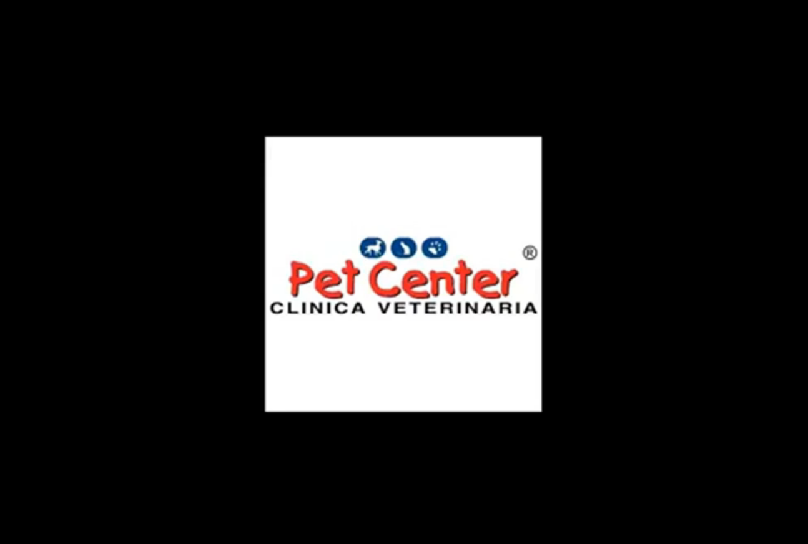

### 2.2.2 Registro de entrevistas

**Segmento: Veterinarias**

|  Nro  | Veterinaria |  
|:-----:|:-----------:|
|   1   |    	  Pet Center      |   
|   2   |     Pet´s Place 	      |   

**Segmento: Dueños de mascotas**

|  Nro  |       Dueño       | Mascota  |      
|:-----:|:-----------------:|:--------:|
|   1   |  Rodrigo Porles   |   Gato   | 
|   2   |  Ronaldo Flores   |  Perro   | 
|   3   |  Aracely Sanchez  |  Perro   |                     

#### Entrevistas técnicos

Entrevista 1

Nombre: Ariel Alberto Rivera Martinez, 30 años, Ate.

Duración de la entrevista: [00:00:00 - 00:09:00]

__Resumen__:

Administrador de PetCenter clinica veterinaria:  
En nuestra clínica veterinaria, atendemos a todo tipo de razas, con un enfoque especial en los canes pequeños, que son más comunes de encontrar en departamentos pequeños. El índice de felinos atendidos es bastante bajo. En promedio, atendemos aproximadamente a unas 30 mascotas al día, ofreciendo una gama de servicios generales y consultas veterinarias. A veces experimentamos problemas en nuestro sistema, como caídas de la plataforma o dificultades en el registro de mascotas, lo que a su vez afecta el seguimiento de los casos caninos. Contamos con un médico veterinario especializado en cada una de nuestras sedes.

En el proceso de diagnóstico, utilizamos ampliamente bases de datos, contrastando la información y verificando si el caso es de origen viral. En caso de emergencias graves, la sede de Ariel no está preparada para atenderlas, por lo que derivamos al paciente lo más rápido posible a una instalación adecuada. Ponemos gran énfasis en realizar un chequeo minucioso en la mascota, evaluando su estado actual de piel, ojos y oídos, para obtener un resumen médico completo de su estado. Utilizamos un sistema de registro completo en la veterinaria que abarca todos los aspectos de nuestro trabajo. Abordamos cualquier problema que surja en la veterinaria con prontitud, priorizando la satisfacción del cliente y la comodidad de sus mascotas en futuras visitas.

Entrevista 2

Duración de la entrevista: [00:09:00 - 00:13:40]

__Resumen__:

#### Entrevistas clientes

Entrevista 3

Duración de la entrevista: [00:13:40 - 00:20:45]

__Resumen__:

Entrevista 4

Duración de la entrevista: [00:20:45 - 00:28:56]

__Resumen__:

